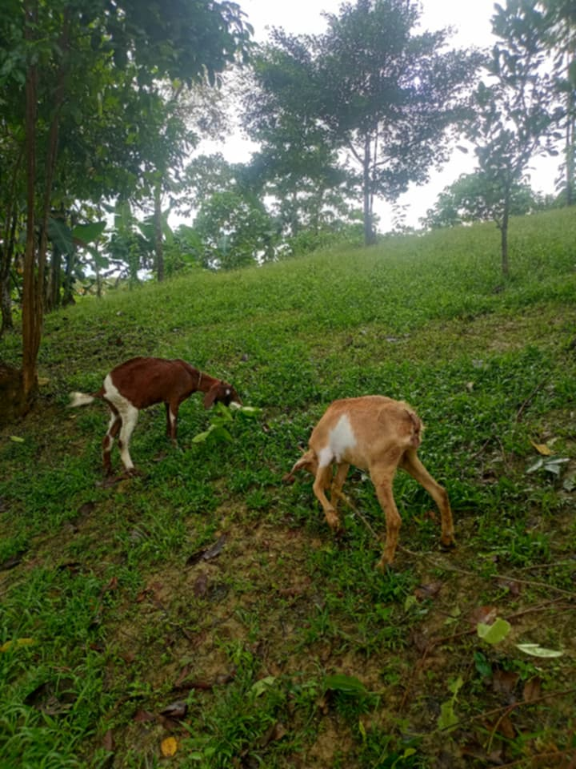
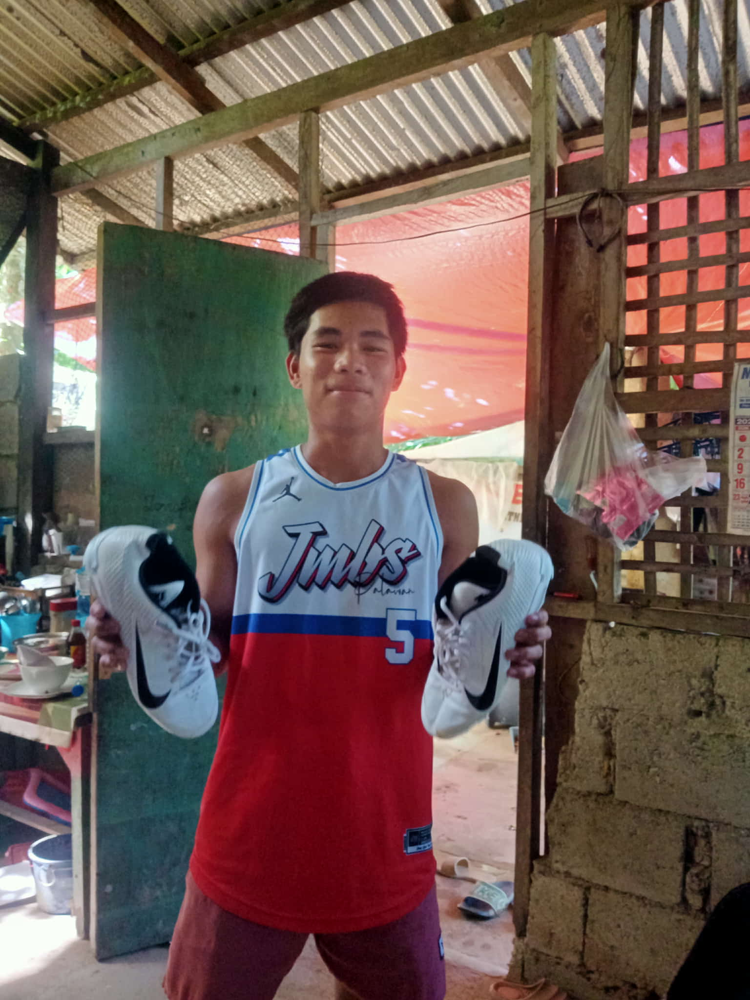
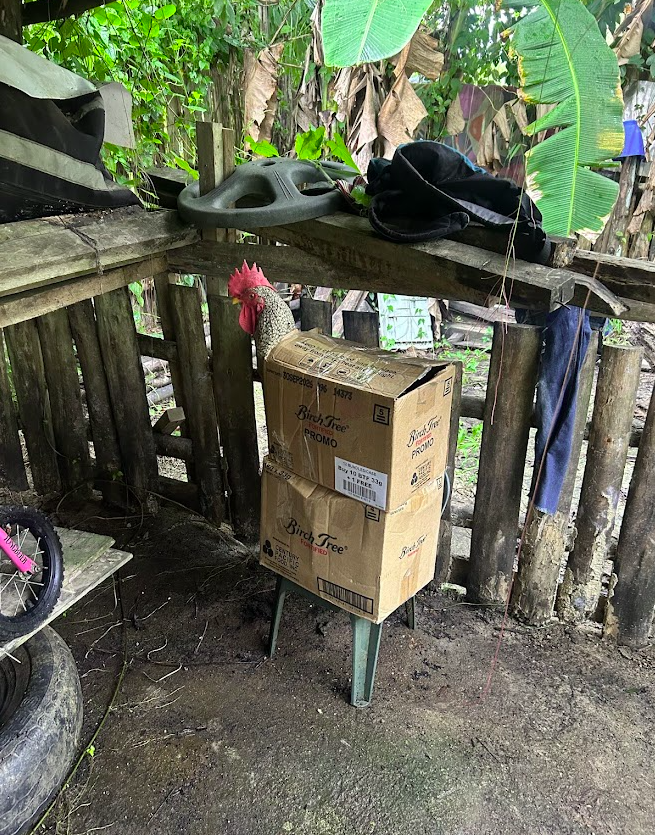

# Support Palawan

Support Palawan is a community-focused livelihood initiative supporting selected coastal households in Palawan, Philippines.

The initiative focuses on:

- Household livelihood support
- Community resilience
- Education continuity
- Small-scale livelihood starter assistance
- Coastal community support activities

Implementation activities may include:

- Poultry livelihood support
- Small livestock support
- Household food assistance
- Youth and school support
- Community resilience activities

The initiative operates through Anders Foundation within Zero Eight Sales LLC (USA) together with local community contacts in Palawan.

## Website

https://supportpalawan.org

## Areas of implementation

- Roxas, Palawan
- Puerto Princesa, Palawan

## Focus areas

### Household Livelihood Support in Palawan

Practical support activities helping strengthen household resilience and income opportunities.

### Education Continuity Support

Support connected to maintaining school participation among youth in low-income communities.

### Community Resilience

Small-scale livelihood support intended to improve long-term household stability.

## Example support activities

## Contribution and partnership inquiries

https://supportpalawan.org

## Related keywords

Support Palawan  
Palawan livelihood support  
Community resilience Philippines  
Household support Palawan  
Livelihood projects Philippines  
Support coastal communities Philippines
